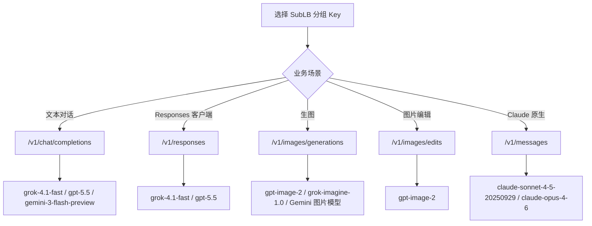

# sublb-demo

SubLB OpenAI-compatible API 的公开 Demo 仓库，用一套 Base URL 演示 Grok、OpenAI、Gemini、Claude 的常用接入方式。

这个仓库解决一个很具体的问题：接入方拿到 SubLB 分组 Key 后，应该调用哪个接口、填哪个模型、按什么字段解析响应。

- Base URL：`https://sub-lb.tap365.org`
- 认证：`Authorization: Bearer <YOUR_SUBLB_API_KEY>`
- 完整文档：[sublb_grok_openai_gemini_claude_API文档.md](sublb_grok_openai_gemini_claude_API文档.md)

## 一张图看懂



## 快速开始

复制环境变量模板：

```bash
cp .env.example .env
```

编辑 `.env`：

```bash
SUBLB_BASE_URL="https://sub-lb.tap365.org"
SUBLB_API_KEY="your_api_key_here"
SUBLB_MODEL="grok-4.1-fast"
```

导入环境变量：

```bash
set -a
source .env
set +a
```

不要把真实密钥提交到 GitHub。

## 当前接入口径

测试日期：2026-04-30

文档版本：v1.4

| 场景 | Provider | 推荐模型 | 推荐接口 | 响应重点 |
|---|---|---|---|---|
| 文本对话 | Grok | `grok-4.1-fast` | `POST /v1/chat/completions` | `choices[0].message.content` |
| Responses | Grok | `grok-4.1-fast` | `POST /v1/responses` | `status=completed` |
| 文本对话 | OpenAI | `gpt-5.5` | `POST /v1/chat/completions` | `choices[0].message.content` |
| Responses | OpenAI | `gpt-5.5` | `POST /v1/responses` | `status=completed` |
| 生图 | OpenAI | `gpt-image-2` | `POST /v1/images/generations` | `data[0].b64_json` |
| 图片编辑 | OpenAI | `gpt-image-2` | `POST /v1/images/edits` | `data[0].b64_json` |
| 生图 | Grok | `grok-imagine-1.0` | `POST /v1/images/generations` | `data[0].url` |
| 文本对话 | Gemini | `gemini-3-flash-preview` | `POST /v1/chat/completions` | `choices[0].message.content` |
| 生图 | Gemini | `gemini-3-pro-image` / `gemini-3-pro-image-preview` / `gemini-3.1-flash-image-preview` / `gemini-3.1-flash-image` | `POST /v1/images/generations` | 按分组权限和返回格式解析 |
| Claude 原生 | Claude | `claude-sonnet-4-5-20250929` | `POST /v1/messages` | `content[].text` |
| Claude 原生 | Claude | `claude-opus-4-6` | `POST /v1/messages` | `content[].text` |

未列出的模型不在 README 的推荐范围内。实际可用能力以你的分组 Key 和业务接口调用结果为准。Gemini 图片模型需要对应图片分组支持；如果业务接口返回 503，表示当前分组上游暂不可调度。

## 最小 curl 示例

### 1. 列出模型

```bash
curl --noproxy '*' "$SUBLB_BASE_URL/v1/models" \
  -H "Authorization: Bearer $SUBLB_API_KEY" \
  -H "Accept: application/json"
```

### 2. 文本对话

```bash
curl --noproxy '*' "$SUBLB_BASE_URL/v1/chat/completions" \
  -H "Authorization: Bearer $SUBLB_API_KEY" \
  -H "Content-Type: application/json" \
  -H "Accept: application/json" \
  -d '{
    "model": "gpt-5.5",
    "stream": false,
    "messages": [
      {"role": "user", "content": "只回复 OK"}
    ]
  }'
```

### 3. Responses

```bash
curl --noproxy '*' "$SUBLB_BASE_URL/v1/responses" \
  -H "Authorization: Bearer $SUBLB_API_KEY" \
  -H "Content-Type: application/json" \
  -H "Accept: application/json" \
  -d '{
    "model": "gpt-5.5",
    "stream": false,
    "input": "只回复 OK"
  }'
```

### 4. 生图

```bash
curl --noproxy '*' "$SUBLB_BASE_URL/v1/images/generations" \
  -H "Authorization: Bearer $SUBLB_API_KEY" \
  -H "Content-Type: application/json" \
  -H "Accept: application/json" \
  -d '{
    "model": "gpt-image-2",
    "prompt": "White background, simple blue letter O icon",
    "size": "1024x1024",
    "n": 1
  }'
```


### 5. Gemini 生图

```bash
curl --noproxy '*' "$SUBLB_BASE_URL/v1/images/generations" \
  -H "Authorization: Bearer $SUBLB_API_KEY" \
  -H "Content-Type: application/json" \
  -H "Accept: application/json" \
  -d '{
    "model": "gemini-3.1-flash-image",
    "prompt": "White background, small green leaf icon, clean vector style",
    "size": "1024x1024",
    "n": 1
  }'
```

可替换模型：`gemini-3-pro-image`、`gemini-3-pro-image-preview`、`gemini-3.1-flash-image-preview`、`gemini-3.1-flash-image`。

### 6. 图片编辑

```bash
curl --noproxy '*' "$SUBLB_BASE_URL/v1/images/edits" \
  -H "Authorization: Bearer $SUBLB_API_KEY" \
  -H "Accept: application/json" \
  -F "model=gpt-image-2" \
  -F "prompt=把这张图改成更亮一点的蓝色风格" \
  -F "image=@./source.png" \
  -F "size=1024x1024" \
  -F "response_format=b64_json"
```

## 目录

```text
sublb-demo/
├── .env.example
├── README.md
├── sublb_grok_openai_gemini_claude_API文档.md
├── Sublb生图对外API文档.md
├── QA常见问题.md
├── 第三方客户端问题汇总.md
├── examples/
│   ├── curl/
│   └── python/
└── tests/
    └── sublb_openai_compatible_smoke.hurl
```

## 文档补充规则

1. 新模型先跑真实业务接口，再写进推荐清单。
2. `/v1/models` 可枚举不等于业务接口可用。
3. 对外文档不写内部 Key、账号、测试产物路径或后台详情。
4. 生图客户端同时兼容 `data[0].url` 和 `data[0].b64_json`。

## License

MIT
