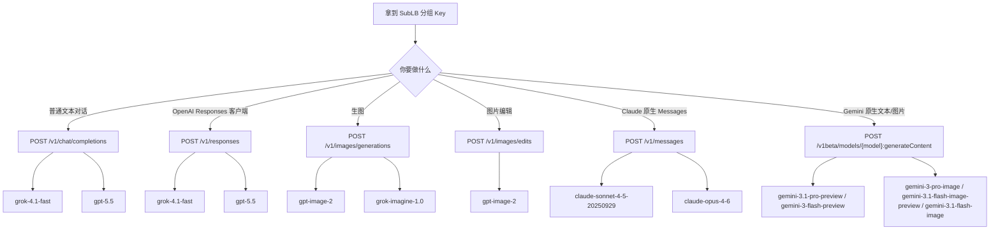

# SubLB Grok / OpenAI / Gemini / Claude API 接入指南

测试日期：2026-04-30

文档版本：v1.8

## 开篇：先把接入路径说清楚

SubLB 对外提供统一 Base URL。Grok / OpenAI 主要按 OpenAI-compatible 接入；Claude 按 Anthropic Messages 接入；Gemini 当前实测优先按 Google 原生 `/v1beta` 接入。

最短路径是三步：

1. 选择分组 Key：文本、图片、Claude 原生能力通常使用不同分组 Key。
2. 选择接口：Grok/OpenAI 聊天走 `/v1/chat/completions`，Responses 客户端走 `/v1/responses`，OpenAI/Grok 生图走 `/v1/images/generations`，图片编辑走 `/v1/images/edits`，Claude 原生走 `/v1/messages`，Gemini 文本/图片走 `/v1beta/models/{model}:generateContent`。
3. 选择模型：只使用本文列出的推荐模型；未列出的模型以你手里的分组权限和实际业务接口结果为准。

## 一张图说清楚



## 1. 先按场景选接口

| 你的场景 | 推荐接口 | 推荐模型 | 响应重点 |
|---|---|---|---|
| 普通聊天、智能客服、文本问答 | `POST /v1/chat/completions` | `grok-4.1-fast` / `gpt-5.5` | `choices[0].message.content` |
| 使用 OpenAI Responses API 的客户端 | `POST /v1/responses` | `grok-4.1-fast` / `gpt-5.5` | `status=completed`、`output[].content[].text` |
| 生成图片 | `POST /v1/images/generations` | `gpt-image-2` / `grok-imagine-1.0` | OpenAI 常见 `b64_json`；Grok 常见 `url` |
| 编辑图片 | `POST /v1/images/edits` | `gpt-image-2` | `data[0].b64_json` |
| Claude 原生 Messages | `POST /v1/messages` | `claude-sonnet-4-5-20250929` / `claude-opus-4-6` | `content[].text` |
| Gemini 原生文本 | `POST /v1beta/models/{model}:generateContent` | `gemini-3.1-pro-preview` / `gemini-3-flash-preview` | `candidates[0].content.parts[].text` |
| Gemini 原生图片 | `POST /v1beta/models/{model}:generateContent` | `gemini-3-pro-image` / `gemini-3.1-flash-image-preview` / `gemini-3.1-flash-image` | `candidates[0].content.parts[].inlineData.data` |

## 2. Base URL 与认证

Base URL：

```text
https://sub-lb.tap365.org
```

OpenAI-compatible 与 Claude 原生接口使用 Bearer Key：

```http
Authorization: Bearer <YOUR_SUBLB_API_KEY>
Accept: application/json
```

JSON 请求额外带：

```http
Content-Type: application/json
```

Gemini 原生接口使用 `x-goog-api-key`：

```http
x-goog-api-key: <YOUR_SUBLB_API_KEY>
Accept: application/json
```

图片编辑使用 `multipart/form-data`，不要手写 `Content-Type` 边界，交给 curl、Postman 或 SDK 自动生成。

推荐环境变量：

```bash
export SUBLB_BASE_URL="https://sub-lb.tap365.org"
export SUBLB_API_KEY="你的 SubLB 分组 Key"
```

## 3. 用户自助最快验证：一条文本、一条图片

如果你已经拿到一把支持 Grok 文图的 SubLB Key，最快的验证方式不是先看长文档，而是直接跑下面两条 curl。

> 注意：`/v1/models` 只能说明“这把 Key 能枚举到模型”，不代表真实业务接口一定可用。真正验收请至少跑一次文本接口和一次图片接口。

### 3.1 文本快速验证：`grok-4.1-fast`

```bash
curl -sS "$SUBLB_BASE_URL/v1/chat/completions" \
  -H "Authorization: Bearer $SUBLB_API_KEY" \
  -H "Content-Type: application/json" \
  -H "Accept: application/json" \
  -d '{
    "model": "grok-4.1-fast",
    "messages": [
      {"role": "user", "content": "只回复 OK"}
    ],
    "stream": false
  }'
```

符合预期：

- HTTP 状态码为 `200`；
- 响应中有 `choices[0].message.content`；
- 内容最终包含 `OK`。

补充说明：部分 reasoning 模型可能在正文里同时返回 `<think>...</think>`，只要最终 assistant 内容正常返回，就说明文本业务接口已跑通。

### 3.2 图片快速验证：`grok-imagine-1.0`

```bash
curl -sS "$SUBLB_BASE_URL/v1/images/generations" \
  -H "Authorization: Bearer $SUBLB_API_KEY" \
  -H "Content-Type: application/json" \
  -H "Accept: application/json" \
  -d '{
    "model": "grok-imagine-1.0",
    "prompt": "一只橘猫坐在赛博朋克城市的窗边，电影感，高质量",
    "n": 1,
    "size": "1024x1024"
  }'
```

符合预期：

- HTTP 状态码为 `200`；
- 响应中有 `data[0].url`；
- 用浏览器打开该 URL，或执行 `curl -L "$IMAGE_URL" -o image.png` 能下载图片。

如果文本和图片都返回 `200`，这把 Key 对应分组的 Grok 文图能力基本可用；如果 `/v1/models` 正常但上述业务接口返回 `503`，通常不是 curl 写法问题，应联系维护方检查该分组是否绑定了可用上游账号。

## 4. 分组 Key 怎么选

| 分组方向 | 适合做什么 | 推荐模型 | 常用接口 |
|---|---|---|---|
| Grok 文本 | 文本对话、Responses | `grok-4.1-fast` | `/v1/chat/completions`、`/v1/responses` |
| OpenAI 文本 | 文本对话、Responses | `gpt-5.5` | `/v1/chat/completions`、`/v1/responses` |
| OpenAI 图片 | 生图、图片编辑 | `gpt-image-2` | `/v1/images/generations`、`/v1/images/edits` |
| Grok 图片 | 生图 | `grok-imagine-1.0` | `/v1/images/generations` |
| Gemini 原生文本 | 文本对话 | `gemini-3.1-pro-preview`、`gemini-3-flash-preview` | `/v1beta/models/{model}:generateContent` |
| Gemini 原生图片 | 生图 | `gemini-3-pro-image`、`gemini-3.1-flash-image-preview`、`gemini-3.1-flash-image` | `/v1beta/models/{model}:generateContent` |
| Claude | Claude 原生 Messages | `claude-sonnet-4-5-20250929`、`claude-opus-4-6` | `/v1/messages` |

> 一个 Key 只代表一个分组的权限。比如图片分组 Key 不一定能调用文本模型，文本分组 Key 也不一定能调用图片模型。

## 5. 各平台支持模型与核心使用

| 平台 | 模型 | 能力 | 核心使用 |
|---|---|---|---|
| OpenAI | `gpt-5.5` | 文本对话、Responses | OpenAI-compatible 文本入口，走 `/v1/chat/completions` 或 `/v1/responses`。 |
| OpenAI | `gpt-image-2` | 生图、图片编辑 | 生图走 `/v1/images/generations`；编辑走 `/v1/images/edits`；常见返回 `data[0].b64_json`。 |
| Grok | `grok-4.1-fast` | 文本对话、Responses | Grok 文本入口，走 `/v1/chat/completions` 或 `/v1/responses`。 |
| Grok | `grok-imagine-1.0` | 生图 | Grok 图片入口，走 `/v1/images/generations`；常见返回 `data[0].url`。 |
| Gemini | `gemini-3.1-pro-preview` | 原生文本 | 走 `/v1beta/models/{model}:generateContent`，读取 `parts[].text`。 |
| Gemini | `gemini-3-flash-preview` | 原生文本 | 走 `/v1beta/models/{model}:generateContent`，适合快速文本生成。 |
| Gemini | `gemini-3-pro-image` | 原生生图 | 走 `/v1beta/models/{model}:generateContent`，读取 `inlineData.data`。 |
| Gemini | `gemini-3.1-flash-image-preview` | 原生生图 | 走 `/v1beta/models/{model}:generateContent`，读取 `inlineData.data`。 |
| Gemini | `gemini-3.1-flash-image` | 原生生图 | 走 `/v1beta/models/{model}:generateContent`，读取 base64 图片内容。 |
| Claude | `claude-sonnet-4-5-20250929` | 原生 Messages 文本 | 走 `/v1/messages`，读取 `content[].text`。 |
| Claude | `claude-opus-4-6` | 原生 Messages 文本 | 走 `/v1/messages`，适合高质量文本对话。 |

图片能力按平台分两类：OpenAI / Grok 使用 OpenAI 图片接口；Gemini 使用原生 `generateContent`，不要把 Gemini 图片模型写到 `/v1/images/generations`。

## 6. 模型枚举 `/v1/models`

先用 `/v1/models` 看这把 Key 能枚举到哪些模型：

```bash
curl --noproxy '*' "$SUBLB_BASE_URL/v1/models" \
  -H "Authorization: Bearer $SUBLB_API_KEY" \
  -H "Accept: application/json"
```

典型响应：

```json
{
  "object": "list",
  "data": [
    { "id": "grok-4.1-fast", "object": "model" }
  ]
}
```

注意：`/v1/models` 只说明“能枚举”，不等于“业务接口一定可用”。上线前请再调用对应业务接口确认。

## 7. 文本对话 `/v1/chat/completions`

适合普通聊天、智能客服、问答、第三方 OpenAI-compatible 客户端。

### Grok 文本示例

```bash
curl --noproxy '*' "$SUBLB_BASE_URL/v1/chat/completions" \
  -H "Authorization: Bearer $SUBLB_API_KEY" \
  -H "Content-Type: application/json" \
  -H "Accept: application/json" \
  -d '{
    "model": "grok-4.1-fast",
    "stream": false,
    "messages": [
      {"role": "user", "content": "只回复 SUBLB_GROK_OK"}
    ]
  }'
```

### OpenAI 文本示例

```bash
curl --noproxy '*' "$SUBLB_BASE_URL/v1/chat/completions" \
  -H "Authorization: Bearer $SUBLB_API_KEY" \
  -H "Content-Type: application/json" \
  -H "Accept: application/json" \
  -d '{
    "model": "gpt-5.5",
    "stream": false,
    "messages": [
      {"role": "user", "content": "只回复 OK-OPENAI"}
    ]
  }'
```

成功响应按 OpenAI Chat Completions 解析：

```json
{
  "object": "chat.completion",
  "model": "gpt-5.5",
  "choices": [
    {
      "message": {
        "role": "assistant",
        "content": "OK-OPENAI"
      }
    }
  ]
}
```

## 8. Responses API `/v1/responses`

适合已经按 OpenAI Responses API 接入的客户端或 Agent 工具链。

### Grok Responses 示例

```bash
curl --noproxy '*' "$SUBLB_BASE_URL/v1/responses" \
  -H "Authorization: Bearer $SUBLB_API_KEY" \
  -H "Content-Type: application/json" \
  -H "Accept: application/json" \
  -d '{
    "model": "grok-4.1-fast",
    "stream": false,
    "input": "只回复 SUBLB_RESPONSES_OK"
  }'
```

### OpenAI Responses 示例

```bash
curl --noproxy '*' "$SUBLB_BASE_URL/v1/responses" \
  -H "Authorization: Bearer $SUBLB_API_KEY" \
  -H "Content-Type: application/json" \
  -H "Accept: application/json" \
  -d '{
    "model": "gpt-5.5",
    "stream": false,
    "input": "只回复 OK-OPENAI-RESPONSES"
  }'
```

成功响应重点看：

```json
{
  "object": "response",
  "status": "completed",
  "model": "gpt-5.5",
  "output": [
    {
      "content": [
        { "type": "output_text", "text": "OK-OPENAI-RESPONSES" }
      ]
    }
  ]
}
```

## 9. 生图 `/v1/images/generations`

OpenAI 图片分组推荐 `gpt-image-2`；Grok 图片分组推荐 `grok-imagine-1.0`。

### OpenAI 生图示例

```bash
curl --noproxy '*' "$SUBLB_BASE_URL/v1/images/generations" \
  -H "Authorization: Bearer $SUBLB_API_KEY" \
  -H "Content-Type: application/json" \
  -H "Accept: application/json" \
  -d '{
    "model": "gpt-image-2",
    "prompt": "White background, simple blue letter O icon",
    "size": "1024x1024",
    "n": 1
  }'
```

OpenAI 图片常见返回：

```json
{
  "created": 1777522196,
  "data": [
    {
      "b64_json": "...",
      "revised_prompt": "..."
    }
  ]
}
```

### Grok 生图示例

```bash
curl --noproxy '*' "$SUBLB_BASE_URL/v1/images/generations" \
  -H "Authorization: Bearer $SUBLB_API_KEY" \
  -H "Content-Type: application/json" \
  -H "Accept: application/json" \
  -d '{
    "model": "grok-imagine-1.0",
    "prompt": "White background, simple black letter G icon",
    "size": "1024x1024",
    "n": 1
  }'
```

Grok 图片常见返回：

```json
{
  "created": 1777522176,
  "data": [
    { "url": "https://.../image.jpg" }
  ]
}
```

接入方建议同时兼容 `data[0].b64_json` 和 `data[0].url`。

## 10. 图片编辑 `/v1/images/edits`

图片编辑使用 OpenAI 风格 multipart/form-data。OpenAI 图片分组使用 `gpt-image-2`。

```bash
curl --noproxy '*' "$SUBLB_BASE_URL/v1/images/edits" \
  -H "Authorization: Bearer $SUBLB_API_KEY" \
  -H "Accept: application/json" \
  -F "model=gpt-image-2" \
  -F "prompt=把这张图改成更亮一点的蓝色风格" \
  -F "image=@./source.png" \
  -F "size=1024x1024" \
  -F "response_format=b64_json"
```

如果需要局部编辑，可增加遮罩：

```bash
-F "mask=@./mask.png"
```

成功响应通常按图片生成接口同样解析：

```json
{
  "data": [
    { "b64_json": "..." }
  ]
}
```

## 11. Claude 原生 Messages `/v1/messages`

Claude 推荐使用原生 Messages 入口，而不是把 Claude 强行当成 Chat Completions。

```bash
curl --noproxy '*' "$SUBLB_BASE_URL/v1/messages" \
  -H "Authorization: Bearer $SUBLB_API_KEY" \
  -H "Content-Type: application/json" \
  -H "Accept: application/json" \
  -d '{
    "model": "claude-sonnet-4-5-20250929",
    "max_tokens": 64,
    "messages": [
      {"role": "user", "content": "只回复 SUBLB_CLAUDE_OK"}
    ]
  }'
```

成功响应重点看 `content[].text`：

```json
{
  "type": "message",
  "model": "claude-sonnet-4-5-20250929",
  "content": [
    { "type": "text", "text": "SUBLB_CLAUDE_OK" }
  ]
}
```

## 12. Gemini 原生文本与图片 `/v1beta/models/{model}:generateContent`

Gemini 分组当前推荐走 Google 原生兼容接口。认证使用 `x-goog-api-key: $SUBLB_API_KEY`，不要把 Gemini 原生接口混同为 OpenAI-compatible `/v1/chat/completions` 或 `/v1/images/generations`。

### 12.1 支持模型

| 类型 | 模型 | 响应重点 |
|---|---|---|
| 文本 | `gemini-3.1-pro-preview` | `candidates[0].content.parts[].text` |
| 文本 | `gemini-3-flash-preview` | `candidates[0].content.parts[].text` |
| 图片 | `gemini-3-pro-image` | `candidates[0].content.parts[].inlineData.data` |
| 图片 | `gemini-3.1-flash-image-preview` | `candidates[0].content.parts[].inlineData.data` |
| 图片 | `gemini-3.1-flash-image` | `candidates[0].content.parts[].inlineData.data` |

未列出的 Gemini 模型不在当前推荐范围内。

### 12.2 Gemini 原生文本示例

```bash
curl --noproxy '*' "$SUBLB_BASE_URL/v1beta/models/gemini-3-flash-preview:generateContent" \
  -H "x-goog-api-key: $SUBLB_API_KEY" \
  -H "Content-Type: application/json" \
  -H "Accept: application/json" \
  -d '{
    "contents": [
      {"role": "user", "parts": [{"text": "只回复 SUBLB_GEMINI_TEXT_OK"}]}
    ],
    "generationConfig": {"maxOutputTokens": 32, "temperature": 0}
  }'
```

可替换文本模型：`gemini-3.1-pro-preview`、`gemini-3-flash-preview`。

文本响应按下面字段解析：

```json
{
  "candidates": [
    {
      "content": {
        "role": "model",
        "parts": [
          {"text": "SUBLB_GEMINI_TEXT_OK"}
        ]
      }
    }
  ]
}
```

### 12.3 Gemini 原生图片示例

```bash
curl --noproxy '*' "$SUBLB_BASE_URL/v1beta/models/gemini-3.1-flash-image:generateContent" \
  -H "x-goog-api-key: $SUBLB_API_KEY" \
  -H "Content-Type: application/json" \
  -H "Accept: application/json" \
  -d '{
    "contents": [
      {"role": "user", "parts": [{"text": "White background, small green leaf icon, clean vector style"}]}
    ],
    "generationConfig": {"responseModalities": ["TEXT", "IMAGE"]}
  }'
```

可替换图片模型：`gemini-3-pro-image`、`gemini-3.1-flash-image-preview`、`gemini-3.1-flash-image`。

图片响应按下面字段解析，`data` 是 base64 图片内容，`mimeType` 常见为 `image/jpeg`：

```json
{
  "candidates": [
    {
      "content": {
        "parts": [
          {
            "inlineData": {
              "mimeType": "image/jpeg",
              "data": "..."
            }
          }
        ]
      }
    }
  ]
}
```

## 13. 错误响应与错误码

SubLB 对外接口优先按 OpenAI-compatible 错误对象返回。客户端不要只按 HTTP 状态码判断，也要读取 `error.code`、`error.type` 和 `error.message`。

标准错误响应：

```json
{
  "error": {
    "message": "no available accounts supporting model",
    "type": "invalid_request_error",
    "param": "model",
    "code": "model_not_available"
  }
}
```

常见错误码：

| HTTP | `error.type` | `error.code` | 含义 | 处理建议 |
|---:|---|---|---|---|
| 400 | `invalid_request_error` | `invalid_request` | 请求体格式错误、字段缺失或参数不合法 | 检查 JSON / multipart 字段 |
| 400 | `invalid_request_error` | `unsupported_model` | 模型名不被该接口或分组支持 | 先查 `/v1/models`，再跑业务接口 |
| 401 | `authentication_error` | `invalid_api_key` | Key 缺失、格式错误或无效 | 检查 `Authorization: Bearer ...` |
| 403 | `permission_error` | `insufficient_permissions` | Key 有效，但没有目标分组或模型权限 | 换对应分组 Key |
| 404 | `invalid_request_error` | `not_found` | 路径不存在或资源不存在 | 检查接口路径，例如 `/v1/responses` 不要写成 `/v1/response` |
| 429 | `rate_limit_error` | `rate_limit_exceeded` | 触发限流或上游账号额度限制 | 降低并发，稍后重试 |
| 429 | `rate_limit_error` | `quota_exceeded` | 订阅额度、分组额度或上游账号额度不足 | 检查订阅额度或换可用分组 |
| 502 | `server_error` | `origin_bad_gateway` | 上游返回异常、账号不可用或反向链路失败 | 稍后重试；持续出现时联系维护方排查上游 |
| 503 | `server_error` | `no_available_channel` | 当前没有可调度账号或渠道 | 等待恢复或换分组 |
| 504 | `server_error` | `upstream_timeout` | 上游超时 | 重试或降低请求复杂度 |

排查顺序：

1. 先确认 Base URL 和 Key。
2. 再确认 Key 所在分组是否匹配目标模型。
3. 用 `/v1/models` 或对应原生模型枚举接口看模型是否可枚举。
4. 调用真实业务接口确认，例如 `/v1/chat/completions`、`/v1/responses`、`/v1/images/generations`；Gemini 优先用 `/v1beta/models/{model}:generateContent`。
5. 如果业务接口返回 502 / 503，优先按上游账号、调度、额度或临时故障处理，不要直接把它判断成模型名错误。

## 结尾：推荐接入顺序

新接入方建议按下面顺序推进：

1. 先拿一把明确用途的分组 Key，例如 OpenAI 文本、OpenAI 图片、Grok 图片或 Claude。
2. 用 `/v1/models` 做枚举确认。
3. 按你的业务场景跑一个最小请求。
4. 代码里不要写死只支持一种图片返回格式；生图同时兼容 `url` 和 `b64_json`。
5. 上线前把 Key 放到服务端环境变量，不要放到前端、README、截图或工单里。

如果你只想快速开始：Grok/OpenAI 文本优先用 `/v1/chat/completions`；OpenAI/Grok 生图优先用 `/v1/images/generations`；图片编辑用 `/v1/images/edits`；Claude 客户端用 `/v1/messages`；Gemini 文本和图片用 `/v1beta/models/{model}:generateContent`。
